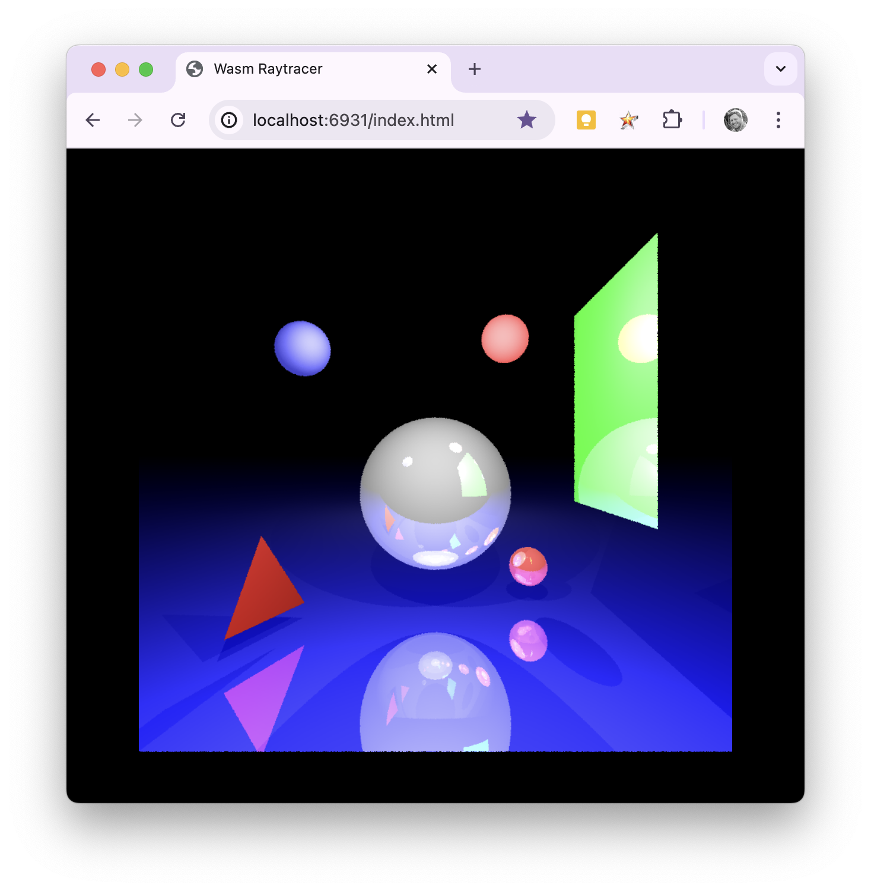

# raywasm

Running an old C-based CPU ray tracer computer science assignment in Wasm.

## Setup

- Install C build tools for your platform.
- Install [emscripten](https://emscripten.org/).

## Building

- Run `make`.

## Configuring

- Tweak `input.js` to build out a ray traced world.
- Tweak the raytracer settings in `index.html` to adjust the rendered size and quality.
  - There's also a CSS style that determines the canvas width.

## Running

- Run `make run` to start a local web server and load the project.

## Cleaning

- Run `make clean`.
